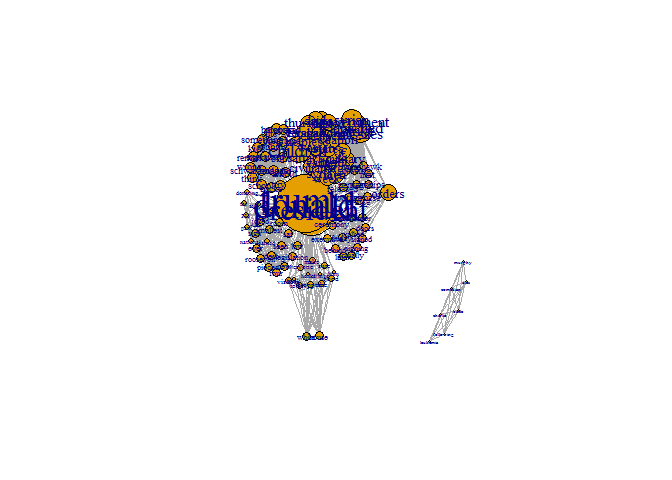

Setting a working directory:

``` r
folder = 'C:\\Users\\DELL\\Desktop\\study\\year4\\DataS\\HW3'
setwd(folder)

#Or for all chuncks in this Rmarkdown:
knitr::opts_knit$set(root.dir = folder)
```

Task 1:
=======

Load Grey's Anatomy network of romances (ga\_edgelist.csv).

``` r
#install.packages('igraph')
library(igraph)
ga.data <- read.csv('ga_edgelist.csv', header = T)
g <- graph.data.frame(ga.data,directed = F)
```

Calculate degree for the various nodes, set vertix size according to its degree and plot the graph.

``` r
set.seed(123)
degr.score <- degree(g)
V(g)$size <- degr.score * 2 # multiply by 2 for scale 
plot(g) 
```


Calculate betweenness score- The vertex betweenness are (roughly) defined by the number of geodesics (shortest paths) going through a vertex

``` r
betweenness_score = betweenness(g)
betweenness_score = sort(betweenness_score, decreasing = TRUE)
betweenness_score
```

    ##        sloan        karev       altman       torres         owen 
    ##    115.36667     95.26667     76.00000     67.15000     60.00000 
    ##     o'malley        izzie         grey      addison         yang 
    ##     54.41667     47.95000     46.86667     44.08333     43.00000 
    ##         lexi        derek       olivia   ellis grey        chief 
    ##     36.00000     17.95000      4.95000      4.00000      3.00000 
    ##  thatch grey       bailey   susan grey      arizona        colin 
    ##      3.00000      1.00000      0.00000      0.00000      0.00000 
    ##      preston       kepner        nancy mrs. seabury        adele 
    ##      0.00000      0.00000      0.00000      0.00000      0.00000 
    ##       tucker         hank        denny         finn        steve 
    ##      0.00000      0.00000      0.00000      0.00000      0.00000 
    ##          ben        avery 
    ##      0.00000      0.00000

\*sloan 115.36667

Calculate closeness- Closeness is based on the length of the average shortest path between a node and all other nodes in the network. Cloness centrality measures how many steps is required to access every other vertex from a given vertex.

``` r
closeness_score = closeness(g, mode="all")
closeness_score = sort(closeness_score, decreasing = TRUE)
closeness_score
```

    ##       torres        sloan        karev      addison     o'malley 
    ##  0.003194888  0.003174603  0.003174603  0.003174603  0.003134796 
    ##         lexi        izzie        derek       altman       olivia 
    ##  0.003115265  0.003076923  0.003039514  0.003039514  0.003039514 
    ##         grey      arizona       kepner        nancy mrs. seabury 
    ##  0.003003003  0.002985075  0.002967359  0.002967359  0.002967359 
    ##        avery         owen         hank        denny         finn 
    ##  0.002915452  0.002898551  0.002881844  0.002881844  0.002816901 
    ##        steve         yang        colin      preston   ellis grey 
    ##  0.002816901  0.002754821  0.002597403  0.002597403  0.001149425 
    ##        chief  thatch grey   susan grey        adele       bailey 
    ##  0.001148106  0.001148106  0.001144165  0.001144165  0.001075269 
    ##       tucker          ben 
    ##  0.001074114  0.001074114

\*torres 0.003194888

5.Eigenvector centrality score- How central you are depends on how central your neighbors are. Centrality is proportional to the sum of neighbors’ centralities.

``` r
Eigenvector_score = eigen_centrality(g, directed = TRUE, scale = TRUE, weights = NULL,
  options = arpack_defaults)
Eigenvector_score
```

    ## $vector
    ##         lexi         owen        sloan       torres        derek 
    ## 5.255806e-01 6.780381e-02 6.418121e-01 7.178773e-01 2.500302e-01 
    ##        karev     o'malley         yang         grey        chief 
    ## 1.000000e+00 6.006975e-01 2.394956e-02 3.004927e-01 4.002260e-17 
    ##   ellis grey   susan grey       bailey        izzie       altman 
    ## 5.532675e-17 2.984342e-17 5.757713e-17 5.653959e-01 2.077024e-01 
    ##      arizona        colin      preston       kepner      addison 
    ## 2.101205e-01 7.009961e-03 7.009961e-03 2.926969e-01 5.537364e-01 
    ##        nancy       olivia mrs. seabury        adele  thatch grey 
    ## 1.878564e-01 4.685192e-01 2.926969e-01 1.432026e-18 5.116882e-17 
    ##       tucker         hank        denny         finn        steve 
    ## 3.022207e-18 1.654896e-01 1.654896e-01 8.795329e-02 8.795329e-02 
    ##          ben        avery 
    ## 2.015682e-17 1.538358e-01 
    ## 
    ## $value
    ## [1] 3.416503
    ## 
    ## $options
    ## $options$bmat
    ## [1] "I"
    ## 
    ## $options$n
    ## [1] 32
    ## 
    ## $options$which
    ## [1] "LA"
    ## 
    ## $options$nev
    ## [1] 1
    ## 
    ## $options$tol
    ## [1] 0
    ## 
    ## $options$ncv
    ## [1] 0
    ## 
    ## $options$ldv
    ## [1] 0
    ## 
    ## $options$ishift
    ## [1] 1
    ## 
    ## $options$maxiter
    ## [1] 1000
    ## 
    ## $options$nb
    ## [1] 1
    ## 
    ## $options$mode
    ## [1] 1
    ## 
    ## $options$start
    ## [1] 1
    ## 
    ## $options$sigma
    ## [1] 0
    ## 
    ## $options$sigmai
    ## [1] 0
    ## 
    ## $options$info
    ## [1] 0
    ## 
    ## $options$iter
    ## [1] 3
    ## 
    ## $options$nconv
    ## [1] 1
    ## 
    ## $options$numop
    ## [1] 32
    ## 
    ## $options$numopb
    ## [1] 0
    ## 
    ## $options$numreo
    ## [1] 21

\*karev 1.0

``` r
#install.packages("devtools")
#library(devtools)
```

``` r
#install_github("Rfacebook", "pablobarbera", subdir="Rfacebook")
require (Rfacebook)
```

    ## Loading required package: Rfacebook

    ## Loading required package: httr

    ## Warning: package 'httr' was built under R version 3.3.3

    ## Loading required package: rjson

    ## Loading required package: httpuv

    ## Warning: package 'httpuv' was built under R version 3.3.3

    ## 
    ## Attaching package: 'Rfacebook'

    ## The following object is masked from 'package:methods':
    ## 
    ##     getGroup

Analyze Facebook

``` r
tokenn='EAACEdEose0cBADD9bkpCWhZC0isw3hL87YS5tgFmPChKX9ZCV3dZBZA99FHAYSmXXkkZB0kTodY0lH00XZCarinOpgxxXCPBAIC8omgY52MI8fEl0fEfJ7WmWkyADgZCKOdkcY2kNihIbvC4ZAJqiuxvwdieibw6UY7fwz2LR3ZAYSNgenDugS2Hm'
```

Get 10 posts from page "cnnbrknews" from facebook @cr extract the messages @cr create Term-Document Matrix from the posts- without Punctuation and stopwords @cr Build a term-Document graph that displays connections between terms that appear together in common posts @cr Beautify our graph by setting the degree attribute (normlize the label size by dividing with maximal size). @cr display plot of graph with kamada kawai algorithm

``` r
#install.packages(tm)
library(tm)
```

    ## Warning: package 'tm' was built under R version 3.3.3

    ## Loading required package: NLP

    ## 
    ## Attaching package: 'NLP'

    ## The following object is masked from 'package:httr':
    ## 
    ##     content

``` r
load("fb_oauth")
#get data
fb_page <- getPage(page="cnnbrknews", token=fb_oauth, n=10)
```

    ## 10 posts

``` r
corpus <- Corpus(VectorSource(fb_page$message))

#create term-Document Matrix
termDocMatrix=TermDocumentMatrix(corpus,control = list(removePunctuation = TRUE,
                                         stopwords = TRUE))
#create term-Document graph 
require(igraph)
net <- graph.incidence(termDocMatrix)

proj_net <- bipartite.projection(net)
net <- proj_net$proj1

#Beautify our graph
degr.score <- degree(net)
V(net)$size <- degr.score * 0.5 # multiply by 2 for scale 
V(net)$label.cex<-  2.2 * V(net)$size / max(V(net)$size) + .2

#print the graph 
l <- layout_with_kk(net)
plot(net, layout=l)
```



``` r
tkplot(net, layout=l)
```

    ## [1] 1

``` r
summary(net)
```

    ## IGRAPH UNW- 115 1234 -- 
    ## + attr: name (v/c), size (v/n), label.cex (v/n), weight (e/n)

calc betweenness\_score

``` r
betweenness_score = betweenness(net)
betweenness_score = sort(betweenness_score, decreasing = TRUE)
betweenness_score
```

    ##         donald          trump      president       children         orders 
    ##   1.557232e+03   1.557232e+03   9.474704e+02   2.440660e+02   9.454412e+01 
    ##     government       launched       missiles         strike         syrian 
    ##   3.120294e+01   3.120294e+01   3.120294e+01   3.120294e+01   3.120294e+01 
    ##        dropped       everyone           good           make           sure 
    ##   1.457452e+01   1.457452e+01   1.457452e+01   1.457452e+01   1.457452e+01 
    ##           time          today       visitors         climbs          honks 
    ##   1.457452e+01   1.457452e+01   1.457452e+01   1.457452e+01   1.457452e+01 
    ##           horn          truck        airbase         cruise          first 
    ##   1.457452e+01   1.457452e+01   8.762735e+00   8.762735e+00   8.762735e+00 
    ##        footage       pentagon       released        showing       tomahawk 
    ##   8.762735e+00   8.762735e+00   8.762735e+00   8.762735e+00   8.762735e+00 
    ##       warships         attack       chemical         choked      civilians 
    ##   8.762735e+00   6.409981e+00   6.409981e+00   6.409981e+00   6.409981e+00 
    ##        earlier       helpless          lives            men       military 
    ##   6.409981e+00   6.409981e+00   6.409981e+00   6.409981e+00   6.409981e+00 
    ##          night    retaliation           said         states          syria 
    ##   6.409981e+00   6.409981e+00   6.409981e+00   6.409981e+00   6.409981e+00 
    ##        targets       thursday         united         weapon           week 
    ##   6.409981e+00   6.409981e+00   6.409981e+00   6.409981e+00   6.409981e+00 
    ##          women       ג€œassad            ג€          house          white 
    ##   6.409981e+00   6.409981e+00   6.409981e+00   6.400000e+00   6.400000e+00 
    ##       actually         behind       ceremony         closed          doors 
    ##   2.437592e+00   2.437592e+00   2.437592e+00   2.437592e+00   2.437592e+00 
    ##      executive         friday          later          order         signed 
    ##   2.437592e+00   2.437592e+00   2.437592e+00   2.437592e+00   2.437592e+00 
    ##        signing         walked        without         arnold          backs 
    ##   2.437592e+00   2.437592e+00   2.437592e+00   5.919715e-02   5.919715e-02 
    ##        balance          blind         budget           cuts      explained 
    ##   5.919715e-02   5.919715e-02   5.919715e-02   5.919715e-02   5.919715e-02 
    ##           kids       programs       proposed        remarks        robbing 
    ##   5.919715e-02   5.919715e-02   5.919715e-02   5.919715e-02   5.919715e-02 
    ##         school schwarzenegger      something          think            try 
    ##   5.919715e-02   5.919715e-02   5.919715e-02   5.919715e-02   5.919715e-02 
    ##          wrong            333       donating         earned            far 
    ##   5.919715e-02   3.605769e-02   3.605769e-02   3.605769e-02   3.605769e-02 
    ##       national           park         salary        service           desk 
    ##   3.605769e-02   3.605769e-02   3.605769e-02   3.605769e-02   3.605769e-02 
    ##           ever           four          joked            law    legislation 
    ##   3.605769e-02   3.605769e-02   3.605769e-02   3.605769e-02   3.605769e-02 
    ##            new         pieces           room      roosevelt            sat 
    ##   3.605769e-02   3.605769e-02   3.605769e-02   3.605769e-02   3.605769e-02 
    ##           seen           sign       smallest         battle        charlie 
    ##   3.605769e-02   3.605769e-02   3.605769e-02   0.000000e+00   0.000000e+00 
    ##       comedian           dies      following       leukemia         murphy 
    ##   0.000000e+00   0.000000e+00   0.000000e+00   0.000000e+00   0.000000e+00

calc closeness\_score

``` r
closeness_score = closeness(net, mode="all")
closeness_score = sort(closeness_score, decreasing = TRUE)
closeness_score
```

    ##         donald          trump      president       children         attack 
    ##   1.083424e-03   1.083424e-03   1.063830e-03   1.025641e-03   1.009082e-03 
    ##       chemical         choked      civilians        earlier       helpless 
    ##   1.009082e-03   1.009082e-03   1.009082e-03   1.009082e-03   1.009082e-03 
    ##          lives            men       military          night    retaliation 
    ##   1.009082e-03   1.009082e-03   1.009082e-03   1.009082e-03   1.009082e-03 
    ##           said         states          syria        targets       thursday 
    ##   1.009082e-03   1.009082e-03   1.009082e-03   1.009082e-03   1.009082e-03 
    ##         united         weapon           week          women       ג€œassad 
    ##   1.009082e-03   1.009082e-03   1.009082e-03   1.009082e-03   1.009082e-03 
    ##            ג€         arnold          backs        balance          blind 
    ##   1.009082e-03   9.980040e-04   9.980040e-04   9.980040e-04   9.980040e-04 
    ##         budget           cuts      explained           kids       programs 
    ##   9.980040e-04   9.980040e-04   9.980040e-04   9.980040e-04   9.980040e-04 
    ##       proposed        remarks        robbing         school schwarzenegger 
    ##   9.980040e-04   9.980040e-04   9.980040e-04   9.980040e-04   9.980040e-04 
    ##      something          think            try          wrong        airbase 
    ##   9.980040e-04   9.980040e-04   9.980040e-04   9.980040e-04   9.960159e-04 
    ##         cruise          first        footage       pentagon       released 
    ##   9.960159e-04   9.960159e-04   9.960159e-04   9.960159e-04   9.960159e-04 
    ##        showing       tomahawk       warships       actually         behind 
    ##   9.960159e-04   9.960159e-04   9.960159e-04   9.950249e-04   9.950249e-04 
    ##       ceremony         closed          doors      executive         friday 
    ##   9.950249e-04   9.950249e-04   9.950249e-04   9.950249e-04   9.950249e-04 
    ##          later          order         signed        signing         walked 
    ##   9.950249e-04   9.950249e-04   9.950249e-04   9.950249e-04   9.950249e-04 
    ##        without           desk           ever           four          joked 
    ##   9.950249e-04   9.891197e-04   9.891197e-04   9.891197e-04   9.891197e-04 
    ##            law    legislation            new         pieces           room 
    ##   9.891197e-04   9.891197e-04   9.891197e-04   9.891197e-04   9.891197e-04 
    ##      roosevelt            sat           seen           sign       smallest 
    ##   9.891197e-04   9.891197e-04   9.891197e-04   9.891197e-04   9.891197e-04 
    ##        dropped       everyone           good           make           sure 
    ##   9.871668e-04   9.871668e-04   9.871668e-04   9.871668e-04   9.871668e-04 
    ##           time          today       visitors            333       donating 
    ##   9.871668e-04   9.871668e-04   9.871668e-04   9.832842e-04   9.832842e-04 
    ##         earned            far       national           park         salary 
    ##   9.832842e-04   9.832842e-04   9.832842e-04   9.832842e-04   9.832842e-04 
    ##        service         climbs          honks           horn          truck 
    ##   9.832842e-04   9.832842e-04   9.832842e-04   9.832842e-04   9.832842e-04 
    ##     government       launched       missiles         strike         syrian 
    ##   9.765625e-04   9.765625e-04   9.765625e-04   9.765625e-04   9.765625e-04 
    ##         orders          house          white         battle        charlie 
    ##   9.541985e-04   9.057971e-04   9.057971e-04   8.047642e-05   8.047642e-05 
    ##       comedian           dies      following       leukemia         murphy 
    ##   8.047642e-05   8.047642e-05   8.047642e-05   8.047642e-05   8.047642e-05

calc Eigenvector\_score

``` r
Eigenvector_score = eigen_centrality(net, scale = TRUE, weights = NULL,
  options = arpack_defaults)
Eigenvector_score
```

    ## $vector
    ##         donald        dropped       everyone           good          house 
    ##     1.00000000     0.10532942     0.10532942     0.10532942     0.19385168 
    ##           make      president           sure           time          today 
    ##     0.10532942     0.92297010     0.10532942     0.10532942     0.10532942 
    ##          trump       visitors          white         battle        charlie 
    ##     1.00000000     0.10532942     0.19385168     0.00000000     0.00000000 
    ##       comedian           dies      following       leukemia         murphy 
    ##     0.00000000     0.00000000     0.00000000     0.00000000     0.00000000 
    ##        airbase         cruise          first        footage     government 
    ##     0.19176637     0.19176637     0.19176637     0.19176637     0.52132366 
    ##       launched       missiles         orders       pentagon       released 
    ##     0.52132366     0.52132366     0.30617143     0.19176637     0.19176637 
    ##        showing         strike         syrian       tomahawk       warships 
    ##     0.19176637     0.52132366     0.52132366     0.19176637     0.19176637 
    ##         attack       chemical       children         choked      civilians 
    ##     0.34277825     0.34277825     0.44558925     0.34277825     0.34277825 
    ##        earlier       helpless          lives            men       military 
    ##     0.34277825     0.34277825     0.34277825     0.34277825     0.34277825 
    ##          night    retaliation           said         states          syria 
    ##     0.34277825     0.34277825     0.34277825     0.34277825     0.34277825 
    ##        targets       thursday         united         weapon           week 
    ##     0.34277825     0.34277825     0.34277825     0.34277825     0.34277825 
    ##          women       ג€œassad            ג€         arnold          backs 
    ##     0.34277825     0.34277825     0.34277825     0.11411130     0.11411130 
    ##        balance          blind         budget           cuts      explained 
    ##     0.11411130     0.11411130     0.11411130     0.11411130     0.11411130 
    ##           kids       programs       proposed        remarks        robbing 
    ##     0.11411130     0.11411130     0.11411130     0.11411130     0.11411130 
    ##         school schwarzenegger      something          think            try 
    ##     0.11411130     0.11411130     0.11411130     0.11411130     0.11411130 
    ##          wrong            333       donating         earned            far 
    ##     0.11411130     0.09299460     0.09299460     0.09299460     0.09299460 
    ##       national           park         salary        service       actually 
    ##     0.09299460     0.09299460     0.09299460     0.09299460     0.12216968 
    ##         behind       ceremony         closed          doors      executive 
    ##     0.12216968     0.12216968     0.12216968     0.12216968     0.12216968 
    ##         friday          later          order         signed        signing 
    ##     0.12216968     0.12216968     0.12216968     0.12216968     0.12216968 
    ##         walked        without           desk           ever           four 
    ##     0.12216968     0.12216968     0.11493452     0.11493452     0.11493452 
    ##          joked            law    legislation            new         pieces 
    ##     0.11493452     0.11493452     0.11493452     0.11493452     0.11493452 
    ##           room      roosevelt            sat           seen           sign 
    ##     0.11493452     0.11493452     0.11493452     0.11493452     0.11493452 
    ##       smallest         climbs          honks           horn          truck 
    ##     0.11493452     0.09343841     0.09343841     0.09343841     0.09343841 
    ## 
    ## $value
    ## [1] 38.43161
    ## 
    ## $options
    ## $options$bmat
    ## [1] "I"
    ## 
    ## $options$n
    ## [1] 115
    ## 
    ## $options$which
    ## [1] "LA"
    ## 
    ## $options$nev
    ## [1] 1
    ## 
    ## $options$tol
    ## [1] 0
    ## 
    ## $options$ncv
    ## [1] 0
    ## 
    ## $options$ldv
    ## [1] 0
    ## 
    ## $options$ishift
    ## [1] 1
    ## 
    ## $options$maxiter
    ## [1] 1000
    ## 
    ## $options$nb
    ## [1] 1
    ## 
    ## $options$mode
    ## [1] 1
    ## 
    ## $options$start
    ## [1] 1
    ## 
    ## $options$sigma
    ## [1] 0
    ## 
    ## $options$sigmai
    ## [1] 0
    ## 
    ## $options$info
    ## [1] 0
    ## 
    ## $options$iter
    ## [1] 1
    ## 
    ## $options$nconv
    ## [1] 1
    ## 
    ## $options$numop
    ## [1] 20
    ## 
    ## $options$numopb
    ## [1] 0
    ## 
    ## $options$numreo
    ## [1] 17
