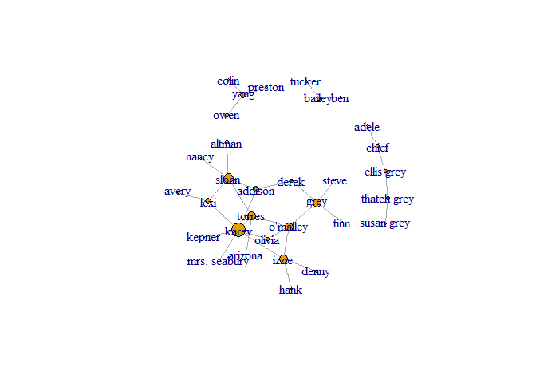

Setting a working directory:

``` r
folder = 'C:\\Users\\DELL\\Desktop\\study\\year4\\DataS\\HW3\\hw3'
setwd(folder)

#Or for all chuncks in this Rmarkdown:
knitr::opts_knit$set(root.dir = folder)
```

Question 1.a:
=============

Load Grey's Anatomy network of romances (ga\_edgelist.csv).

``` r
#install.packages('igraph')
library(igraph)
ga.data <- read.csv('ga_edgelist.csv', header = T)
g <- graph.data.frame(ga.data,directed = F)
```

Calculate degree for the various nodes, set vertix size according to its degree and plot the graph.

``` r
set.seed(123)
degr.score <- degree(g)
V(g)$size <- degr.score * 2 # multiply by 2 for scale 
plot(g) 
```



**Calculate betweenness score-** The vertex betweenness are (roughly) defined by the number of geodesics (shortest paths) going through a vertex \#\#\#Highest- sloan 115.36667

``` r
betweenness_score = betweenness(g)
betweenness_score = sort(betweenness_score, decreasing = TRUE)
betweenness_score
```

    ##        sloan        karev       altman       torres         owen 
    ##    115.36667     95.26667     76.00000     67.15000     60.00000 
    ##     o'malley        izzie         grey      addison         yang 
    ##     54.41667     47.95000     46.86667     44.08333     43.00000 
    ##         lexi        derek       olivia   ellis grey        chief 
    ##     36.00000     17.95000      4.95000      4.00000      3.00000 
    ##  thatch grey       bailey   susan grey      arizona        colin 
    ##      3.00000      1.00000      0.00000      0.00000      0.00000 
    ##      preston       kepner        nancy mrs. seabury        adele 
    ##      0.00000      0.00000      0.00000      0.00000      0.00000 
    ##       tucker         hank        denny         finn        steve 
    ##      0.00000      0.00000      0.00000      0.00000      0.00000 
    ##          ben        avery 
    ##      0.00000      0.00000

**Calculate closeness-** Closeness is based on the length of the average shortest path between a node and all other nodes in the network. Closeness centrality measures how many steps is required to access every other vertex from a given vertex. \#\#\#Highest- torres 0.003194888

``` r
closeness_score = closeness(g, mode="all")
closeness_score = sort(closeness_score, decreasing = TRUE)
closeness_score
```

    ##       torres        sloan        karev      addison     o'malley 
    ##  0.003194888  0.003174603  0.003174603  0.003174603  0.003134796 
    ##         lexi        izzie        derek       altman       olivia 
    ##  0.003115265  0.003076923  0.003039514  0.003039514  0.003039514 
    ##         grey      arizona       kepner        nancy mrs. seabury 
    ##  0.003003003  0.002985075  0.002967359  0.002967359  0.002967359 
    ##        avery         owen         hank        denny         finn 
    ##  0.002915452  0.002898551  0.002881844  0.002881844  0.002816901 
    ##        steve         yang        colin      preston   ellis grey 
    ##  0.002816901  0.002754821  0.002597403  0.002597403  0.001149425 
    ##        chief  thatch grey   susan grey        adele       bailey 
    ##  0.001148106  0.001148106  0.001144165  0.001144165  0.001075269 
    ##       tucker          ben 
    ##  0.001074114  0.001074114

**Eigenvector centrality score-** How central you are depends on how central your neighbors are. Centrality is proportional to the sum of neighbors’ centralities. \#\#\#Highest- torres karev 1.0

``` r
Eigenvector_score = eigen_centrality(g, directed = TRUE, scale = TRUE, weights = NULL,
  options = arpack_defaults)
Eigenvector_score
```

    ## $vector
    ##         lexi         owen        sloan       torres        derek 
    ## 5.255806e-01 6.780381e-02 6.418121e-01 7.178773e-01 2.500302e-01 
    ##        karev     o'malley         yang         grey        chief 
    ## 1.000000e+00 6.006975e-01 2.394956e-02 3.004927e-01 4.002260e-17 
    ##   ellis grey   susan grey       bailey        izzie       altman 
    ## 5.532675e-17 2.984342e-17 5.757713e-17 5.653959e-01 2.077024e-01 
    ##      arizona        colin      preston       kepner      addison 
    ## 2.101205e-01 7.009961e-03 7.009961e-03 2.926969e-01 5.537364e-01 
    ##        nancy       olivia mrs. seabury        adele  thatch grey 
    ## 1.878564e-01 4.685192e-01 2.926969e-01 1.432026e-18 5.116882e-17 
    ##       tucker         hank        denny         finn        steve 
    ## 3.022207e-18 1.654896e-01 1.654896e-01 8.795329e-02 8.795329e-02 
    ##          ben        avery 
    ## 2.015682e-17 1.538358e-01 
    ## 
    ## $value
    ## [1] 3.416503
    ## 
    ## $options
    ## $options$bmat
    ## [1] "I"
    ## 
    ## $options$n
    ## [1] 32
    ## 
    ## $options$which
    ## [1] "LA"
    ## 
    ## $options$nev
    ## [1] 1
    ## 
    ## $options$tol
    ## [1] 0
    ## 
    ## $options$ncv
    ## [1] 0
    ## 
    ## $options$ldv
    ## [1] 0
    ## 
    ## $options$ishift
    ## [1] 1
    ## 
    ## $options$maxiter
    ## [1] 1000
    ## 
    ## $options$nb
    ## [1] 1
    ## 
    ## $options$mode
    ## [1] 1
    ## 
    ## $options$start
    ## [1] 1
    ## 
    ## $options$sigma
    ## [1] 0
    ## 
    ## $options$sigmai
    ## [1] 0
    ## 
    ## $options$info
    ## [1] 0
    ## 
    ## $options$iter
    ## [1] 3
    ## 
    ## $options$nconv
    ## [1] 1
    ## 
    ## $options$numop
    ## [1] 32
    ## 
    ## $options$numopb
    ## [1] 0
    ## 
    ## $options$numreo
    ## [1] 21

Question 1.b:
=============

### Walktrap community detection algorithm

This function tries to find communities in a graph via random walks. The idea is that short random walks tend to stay in the same community.

is an approach based on random walks. The general idea is that if you perform random walks on the graph, then the walks are more likely to stay within the same community because there are only a few edges that lead outside a given community. Walktrap runs short random walks of 4 steps and uses the results of these random walks to merge separate communities in a bottom-up manner.

``` r
# Walktrap community detection algorithm
wc <- cluster_walktrap(g)
algorithm(wc)
```

    ## [1] "walktrap"

``` r
plot(wc, g)
```


``` r
modularity(wc)
```

    ## [1] 0.5147059

number of communities: 7

``` r
wc
```

    ## IGRAPH clustering walktrap, groups: 7, mod: 0.51
    ## + groups:
    ##   $`1`
    ##   [1] "owen"    "yang"    "altman"  "colin"   "preston"
    ##   
    ##   $`2`
    ##    [1] "lexi"         "sloan"        "torres"       "derek"       
    ##    [5] "karev"        "o'malley"     "arizona"      "kepner"      
    ##    [9] "addison"      "nancy"        "olivia"       "mrs. seabury"
    ##   [13] "avery"       
    ##   
    ##   $`3`
    ##   + ... omitted several groups/vertices

size of communities

``` r
table(wc$membership)
```

    ## 
    ##  1  2  3  4  5  6  7 
    ##  5 13  3  3  2  3  3

the groups

``` r
groups(wc)
```

    ## $`1`
    ## [1] "owen"    "yang"    "altman"  "colin"   "preston"
    ## 
    ## $`2`
    ##  [1] "lexi"         "sloan"        "torres"       "derek"       
    ##  [5] "karev"        "o'malley"     "arizona"      "kepner"      
    ##  [9] "addison"      "nancy"        "olivia"       "mrs. seabury"
    ## [13] "avery"       
    ## 
    ## $`3`
    ## [1] "chief"      "ellis grey" "adele"     
    ## 
    ## $`4`
    ## [1] "izzie" "hank"  "denny"
    ## 
    ## $`5`
    ## [1] "susan grey"  "thatch grey"
    ## 
    ## $`6`
    ## [1] "grey"  "finn"  "steve"
    ## 
    ## $`7`
    ## [1] "bailey" "tucker" "ben"

### leading eigenvector community detection algorithm

is a top-down hierarchical approach that optimizes the modularity function again. In each step, the graph is split into two parts in a way that the separation itself yields a significant increase in the modularity. The split is determined by evaluating the leading eigenvector of the so-called modularity matrix, and there is also a stopping condition which prevents tightly connected groups to be split further.

``` r
le <- cluster_leading_eigen(g, steps = -1, weights = NULL, start = NULL,
                            options = arpack_defaults, callback = NULL, extra = NULL,
                            env = parent.frame())
algorithm(le)
```

    ## [1] "leading eigenvector"

``` r
plot(le, g)
```


``` r
modularity(le)
```

    ## [1] 0.592128

number of communities: 6

``` r
le
```

    ## IGRAPH clustering leading eigenvector, groups: 6, mod: 0.59
    ## + groups:
    ##   $`1`
    ##   [1] "lexi"   "sloan"  "altman" "nancy"  "avery" 
    ##   
    ##   $`2`
    ##   [1] "chief"       "ellis grey"  "susan grey"  "adele"       "thatch grey"
    ##   
    ##   $`3`
    ##   [1] "bailey" "tucker" "ben"   
    ##   
    ##   $`4`
    ##   + ... omitted several groups/vertices

size of communities

``` r
table(le$membership)
```

    ## 
    ##  1  2  3  4  5  6 
    ##  5  5  3 10  4  5

the groups

``` r
groups(le)
```

    ## $`1`
    ## [1] "lexi"   "sloan"  "altman" "nancy"  "avery" 
    ## 
    ## $`2`
    ## [1] "chief"       "ellis grey"  "susan grey"  "adele"       "thatch grey"
    ## 
    ## $`3`
    ## [1] "bailey" "tucker" "ben"   
    ## 
    ## $`4`
    ##  [1] "torres"       "karev"        "o'malley"     "izzie"       
    ##  [5] "arizona"      "kepner"       "olivia"       "mrs. seabury"
    ##  [9] "hank"         "denny"       
    ## 
    ## $`5`
    ## [1] "owen"    "yang"    "colin"   "preston"
    ## 
    ## $`6`
    ## [1] "derek"   "grey"    "addison" "finn"    "steve"

Question 2:
===========

Analyze Facebook
----------------

``` r
#install.packages("devtools")
library(devtools)

#install_github("Rfacebook", "pablobarbera", subdir="Rfacebook")
require (Rfacebook)

#install.packages(tm)
library(tm)
```

``` r
load("fb_oauth")
tokenn='EAACEdEose0cBADD9bkpCWhZC0isw3hL87YS5tgFmPChKX9ZCV3dZBZA99FHAYSmXXkkZB0kTodY0lH00XZCarinOpgxxXCPBAIC8omgY52MI8fEl0fEfJ7WmWkyADgZCKOdkcY2kNihIbvC4ZAJqiuxvwdieibw6UY7fwz2LR3ZAYSNgenDugS2Hm'
```

1.  Get 10 posts from page "cnnbrknews" from facebook
2.  Extract the messages
3.  Create Term-Document Matrix from the posts- without Punctuation and stopwords.(Document=message)
4.  Build a term-Document graph that displays connections between terms that appear together in common posts. vertex= term. edge= connections between terms that appear together in common posts
5.  Beautify our graph by setting the degree attribute (normlize the label size by dividing with maximal size).
6.  Display plot of graph with kamada kawai algorithm

``` r
#get the data- 10 posts from page "cnnbrknews""
fb_page <- getPage(page="cnnbrknews", token=fb_oauth, n=10)
```

    ## 10 posts

``` r
corpus <- Corpus(VectorSource(fb_page$message))

#create term-Document Matrix without Punctuation and stopwords
termDocMatrix=TermDocumentMatrix(corpus,control = list(removePunctuation = TRUE,
                                         stopwords = TRUE))

termDocMatrix
```

    ## <<TermDocumentMatrix (terms: 115, documents: 10)>>
    ## Non-/sparse entries: 144/1006
    ## Sparsity           : 87%
    ## Maximal term length: 14
    ## Weighting          : term frequency (tf)

``` r
termDocMatrix1 <- as.matrix(termDocMatrix)
termDocMatrix1[0:10,]
```

    ##            Docs
    ## Terms       1 2 3 4 5 6 7 8 9 10
    ##   donald    1 0 1 1 1 1 1 0 1  1
    ##   dropped   1 0 0 0 0 0 0 0 0  0
    ##   everyone  1 0 0 0 0 0 0 0 0  0
    ##   good      1 0 0 0 0 0 0 0 0  0
    ##   house     1 0 0 0 0 0 0 0 0  1
    ##   make      1 0 0 0 0 0 0 0 0  0
    ##   president 1 0 1 1 0 1 1 0 1  1
    ##   sure      1 0 0 0 0 0 0 0 0  0
    ##   time      1 0 0 0 0 0 0 0 0  0
    ##   today     1 0 0 0 0 0 0 0 0  0

``` r
#create term-Document graph 
require(igraph)
net <- graph.incidence(termDocMatrix)
proj_net <- bipartite.projection(net)
net <- proj_net$proj1
```

``` r
#Beautify our graph
degr.score <- degree(net)
V(net)$size <- degr.score * 0.5 # multiply by 0.5 for scale 
V(net)$label.cex<-  2.2 * V(net)$size / max(V(net)$size) + .2
```

``` r
#print the graph 
l <- layout_with_kk(net)
plot(net, layout=l)
```


``` r
tkplot(net, layout=l)
```

    ## [1] 1

``` r
summary(net)
```

    ## IGRAPH UNW- 115 1234 -- 
    ## + attr: name (v/c), size (v/n), label.cex (v/n), weight (e/n)


world cloud- we can see the major terms (minimum freq=3)

``` r
#install.packages('wordcloud')
library(wordcloud)
```

    ## Warning: package 'wordcloud' was built under R version 3.3.3

    ## Loading required package: RColorBrewer

``` r
corpus <- tm_map(corpus, removePunctuation)
corpus <- tm_map(corpus, function(x)removeWords(x,stopwords()))

wordcloud(corpus,min.freq=3)
```


calc betweenness\_score: Highest-donald, trump 1.557232e+03

``` r
betweenness_score = betweenness(net)
betweenness_score = sort(betweenness_score, decreasing = TRUE)
betweenness_score
```

    ##         donald          trump      president       children         orders 
    ##   1.557232e+03   1.557232e+03   9.474704e+02   2.440660e+02   9.454412e+01 
    ##     government       launched       missiles         strike         syrian 
    ##   3.120294e+01   3.120294e+01   3.120294e+01   3.120294e+01   3.120294e+01 
    ##        dropped       everyone           good           make           sure 
    ##   1.457452e+01   1.457452e+01   1.457452e+01   1.457452e+01   1.457452e+01 
    ##           time          today       visitors         climbs          honks 
    ##   1.457452e+01   1.457452e+01   1.457452e+01   1.457452e+01   1.457452e+01 
    ##           horn          truck        airbase         cruise          first 
    ##   1.457452e+01   1.457452e+01   8.762735e+00   8.762735e+00   8.762735e+00 
    ##        footage       pentagon       released        showing       tomahawk 
    ##   8.762735e+00   8.762735e+00   8.762735e+00   8.762735e+00   8.762735e+00 
    ##       warships         attack       chemical         choked      civilians 
    ##   8.762735e+00   6.409981e+00   6.409981e+00   6.409981e+00   6.409981e+00 
    ##        earlier       helpless          lives            men       military 
    ##   6.409981e+00   6.409981e+00   6.409981e+00   6.409981e+00   6.409981e+00 
    ##          night    retaliation           said         states          syria 
    ##   6.409981e+00   6.409981e+00   6.409981e+00   6.409981e+00   6.409981e+00 
    ##        targets       thursday         united         weapon           week 
    ##   6.409981e+00   6.409981e+00   6.409981e+00   6.409981e+00   6.409981e+00 
    ##          women       ג€œassad            ג€          house          white 
    ##   6.409981e+00   6.409981e+00   6.409981e+00   6.400000e+00   6.400000e+00 
    ##       actually         behind       ceremony         closed          doors 
    ##   2.437592e+00   2.437592e+00   2.437592e+00   2.437592e+00   2.437592e+00 
    ##      executive         friday          later          order         signed 
    ##   2.437592e+00   2.437592e+00   2.437592e+00   2.437592e+00   2.437592e+00 
    ##        signing         walked        without         arnold          backs 
    ##   2.437592e+00   2.437592e+00   2.437592e+00   5.919715e-02   5.919715e-02 
    ##        balance          blind         budget           cuts      explained 
    ##   5.919715e-02   5.919715e-02   5.919715e-02   5.919715e-02   5.919715e-02 
    ##           kids       programs       proposed        remarks        robbing 
    ##   5.919715e-02   5.919715e-02   5.919715e-02   5.919715e-02   5.919715e-02 
    ##         school schwarzenegger      something          think            try 
    ##   5.919715e-02   5.919715e-02   5.919715e-02   5.919715e-02   5.919715e-02 
    ##          wrong            333       donating         earned            far 
    ##   5.919715e-02   3.605769e-02   3.605769e-02   3.605769e-02   3.605769e-02 
    ##       national           park         salary        service           desk 
    ##   3.605769e-02   3.605769e-02   3.605769e-02   3.605769e-02   3.605769e-02 
    ##           ever           four          joked            law    legislation 
    ##   3.605769e-02   3.605769e-02   3.605769e-02   3.605769e-02   3.605769e-02 
    ##            new         pieces           room      roosevelt            sat 
    ##   3.605769e-02   3.605769e-02   3.605769e-02   3.605769e-02   3.605769e-02 
    ##           seen           sign       smallest         battle        charlie 
    ##   3.605769e-02   3.605769e-02   3.605769e-02   0.000000e+00   0.000000e+00 
    ##       comedian           dies      following       leukemia         murphy 
    ##   0.000000e+00   0.000000e+00   0.000000e+00   0.000000e+00   0.000000e+00

calc closeness\_score: Highest- donald, trump 1.083424e-03

``` r
closeness_score = closeness(net, mode="all")
closeness_score = sort(closeness_score, decreasing = TRUE)
closeness_score
```

    ##         donald          trump      president       children         attack 
    ##   1.083424e-03   1.083424e-03   1.063830e-03   1.025641e-03   1.009082e-03 
    ##       chemical         choked      civilians        earlier       helpless 
    ##   1.009082e-03   1.009082e-03   1.009082e-03   1.009082e-03   1.009082e-03 
    ##          lives            men       military          night    retaliation 
    ##   1.009082e-03   1.009082e-03   1.009082e-03   1.009082e-03   1.009082e-03 
    ##           said         states          syria        targets       thursday 
    ##   1.009082e-03   1.009082e-03   1.009082e-03   1.009082e-03   1.009082e-03 
    ##         united         weapon           week          women       ג€œassad 
    ##   1.009082e-03   1.009082e-03   1.009082e-03   1.009082e-03   1.009082e-03 
    ##            ג€         arnold          backs        balance          blind 
    ##   1.009082e-03   9.980040e-04   9.980040e-04   9.980040e-04   9.980040e-04 
    ##         budget           cuts      explained           kids       programs 
    ##   9.980040e-04   9.980040e-04   9.980040e-04   9.980040e-04   9.980040e-04 
    ##       proposed        remarks        robbing         school schwarzenegger 
    ##   9.980040e-04   9.980040e-04   9.980040e-04   9.980040e-04   9.980040e-04 
    ##      something          think            try          wrong        airbase 
    ##   9.980040e-04   9.980040e-04   9.980040e-04   9.980040e-04   9.960159e-04 
    ##         cruise          first        footage       pentagon       released 
    ##   9.960159e-04   9.960159e-04   9.960159e-04   9.960159e-04   9.960159e-04 
    ##        showing       tomahawk       warships       actually         behind 
    ##   9.960159e-04   9.960159e-04   9.960159e-04   9.950249e-04   9.950249e-04 
    ##       ceremony         closed          doors      executive         friday 
    ##   9.950249e-04   9.950249e-04   9.950249e-04   9.950249e-04   9.950249e-04 
    ##          later          order         signed        signing         walked 
    ##   9.950249e-04   9.950249e-04   9.950249e-04   9.950249e-04   9.950249e-04 
    ##        without           desk           ever           four          joked 
    ##   9.950249e-04   9.891197e-04   9.891197e-04   9.891197e-04   9.891197e-04 
    ##            law    legislation            new         pieces           room 
    ##   9.891197e-04   9.891197e-04   9.891197e-04   9.891197e-04   9.891197e-04 
    ##      roosevelt            sat           seen           sign       smallest 
    ##   9.891197e-04   9.891197e-04   9.891197e-04   9.891197e-04   9.891197e-04 
    ##        dropped       everyone           good           make           sure 
    ##   9.871668e-04   9.871668e-04   9.871668e-04   9.871668e-04   9.871668e-04 
    ##           time          today       visitors            333       donating 
    ##   9.871668e-04   9.871668e-04   9.871668e-04   9.832842e-04   9.832842e-04 
    ##         earned            far       national           park         salary 
    ##   9.832842e-04   9.832842e-04   9.832842e-04   9.832842e-04   9.832842e-04 
    ##        service         climbs          honks           horn          truck 
    ##   9.832842e-04   9.832842e-04   9.832842e-04   9.832842e-04   9.832842e-04 
    ##     government       launched       missiles         strike         syrian 
    ##   9.765625e-04   9.765625e-04   9.765625e-04   9.765625e-04   9.765625e-04 
    ##         orders          house          white         battle        charlie 
    ##   9.541985e-04   9.057971e-04   9.057971e-04   8.047642e-05   8.047642e-05 
    ##       comedian           dies      following       leukemia         murphy 
    ##   8.047642e-05   8.047642e-05   8.047642e-05   8.047642e-05   8.047642e-05

calc Eigenvector\_score: Highest- donald, trump 1.00000000

``` r
Eigenvector_score = eigen_centrality(net, scale = TRUE, weights = NULL,
  options = arpack_defaults)
Eigenvector_score
```

    ## $vector
    ##         donald        dropped       everyone           good          house 
    ##   1.000000e+00   1.053294e-01   1.053294e-01   1.053294e-01   1.938517e-01 
    ##           make      president           sure           time          today 
    ##   1.053294e-01   9.229701e-01   1.053294e-01   1.053294e-01   1.053294e-01 
    ##          trump       visitors          white         battle        charlie 
    ##   1.000000e+00   1.053294e-01   1.938517e-01   9.995579e-18   9.995579e-18 
    ##       comedian           dies      following       leukemia         murphy 
    ##   9.995579e-18   9.995579e-18   2.998674e-17   1.999116e-17   9.995579e-18 
    ##        airbase         cruise          first        footage     government 
    ##   1.917664e-01   1.917664e-01   1.917664e-01   1.917664e-01   5.213237e-01 
    ##       launched       missiles         orders       pentagon       released 
    ##   5.213237e-01   5.213237e-01   3.061714e-01   1.917664e-01   1.917664e-01 
    ##        showing         strike         syrian       tomahawk       warships 
    ##   1.917664e-01   5.213237e-01   5.213237e-01   1.917664e-01   1.917664e-01 
    ##         attack       chemical       children         choked      civilians 
    ##   3.427783e-01   3.427783e-01   4.455893e-01   3.427783e-01   3.427783e-01 
    ##        earlier       helpless          lives            men       military 
    ##   3.427783e-01   3.427783e-01   3.427783e-01   3.427783e-01   3.427783e-01 
    ##          night    retaliation           said         states          syria 
    ##   3.427783e-01   3.427783e-01   3.427783e-01   3.427783e-01   3.427783e-01 
    ##        targets       thursday         united         weapon           week 
    ##   3.427783e-01   3.427783e-01   3.427783e-01   3.427783e-01   3.427783e-01 
    ##          women       ג€œassad            ג€         arnold          backs 
    ##   3.427783e-01   3.427783e-01   3.427783e-01   1.141113e-01   1.141113e-01 
    ##        balance          blind         budget           cuts      explained 
    ##   1.141113e-01   1.141113e-01   1.141113e-01   1.141113e-01   1.141113e-01 
    ##           kids       programs       proposed        remarks        robbing 
    ##   1.141113e-01   1.141113e-01   1.141113e-01   1.141113e-01   1.141113e-01 
    ##         school schwarzenegger      something          think            try 
    ##   1.141113e-01   1.141113e-01   1.141113e-01   1.141113e-01   1.141113e-01 
    ##          wrong            333       donating         earned            far 
    ##   1.141113e-01   9.299460e-02   9.299460e-02   9.299460e-02   9.299460e-02 
    ##       national           park         salary        service       actually 
    ##   9.299460e-02   9.299460e-02   9.299460e-02   9.299460e-02   1.221697e-01 
    ##         behind       ceremony         closed          doors      executive 
    ##   1.221697e-01   1.221697e-01   1.221697e-01   1.221697e-01   1.221697e-01 
    ##         friday          later          order         signed        signing 
    ##   1.221697e-01   1.221697e-01   1.221697e-01   1.221697e-01   1.221697e-01 
    ##         walked        without           desk           ever           four 
    ##   1.221697e-01   1.221697e-01   1.149345e-01   1.149345e-01   1.149345e-01 
    ##          joked            law    legislation            new         pieces 
    ##   1.149345e-01   1.149345e-01   1.149345e-01   1.149345e-01   1.149345e-01 
    ##           room      roosevelt            sat           seen           sign 
    ##   1.149345e-01   1.149345e-01   1.149345e-01   1.149345e-01   1.149345e-01 
    ##       smallest         climbs          honks           horn          truck 
    ##   1.149345e-01   9.343841e-02   9.343841e-02   9.343841e-02   9.343841e-02 
    ## 
    ## $value
    ## [1] 38.43161
    ## 
    ## $options
    ## $options$bmat
    ## [1] "I"
    ## 
    ## $options$n
    ## [1] 115
    ## 
    ## $options$which
    ## [1] "LA"
    ## 
    ## $options$nev
    ## [1] 1
    ## 
    ## $options$tol
    ## [1] 0
    ## 
    ## $options$ncv
    ## [1] 0
    ## 
    ## $options$ldv
    ## [1] 0
    ## 
    ## $options$ishift
    ## [1] 1
    ## 
    ## $options$maxiter
    ## [1] 1000
    ## 
    ## $options$nb
    ## [1] 1
    ## 
    ## $options$mode
    ## [1] 1
    ## 
    ## $options$start
    ## [1] 1
    ## 
    ## $options$sigma
    ## [1] 0
    ## 
    ## $options$sigmai
    ## [1] 0
    ## 
    ## $options$info
    ## [1] 0
    ## 
    ## $options$iter
    ## [1] 1
    ## 
    ## $options$nconv
    ## [1] 1
    ## 
    ## $options$numop
    ## [1] 20
    ## 
    ## $options$numopb
    ## [1] 0
    ## 
    ## $options$numreo
    ## [1] 17

Community Detection in Networks
-------------------------------

#### Girvan-Newman community detection

This is a divisive method that works on undirected unweighted networks. It is based on calculating for each edge its edge betweeness- the number of shortest path going through this edge. It then iteratively removes the edge with the highest betweeness score, until reaching some threshold. The remaining connected vertices are communities (clusters).

``` r
net1=proj_net$proj1
```

``` r
gc <-  edge.betweenness.community(net1)
gc
```

    ## IGRAPH clustering edge betweenness, groups: 7, mod: 0.46
    ## + groups:
    ##   $`1`
    ##    [1] "donald"      "president"   "trump"       "airbase"    
    ##    [5] "cruise"      "first"       "footage"     "government" 
    ##    [9] "launched"    "missiles"    "pentagon"    "released"   
    ##   [13] "showing"     "strike"      "syrian"      "tomahawk"   
    ##   [17] "warships"    "attack"      "chemical"    "children"   
    ##   [21] "choked"      "civilians"   "earlier"     "helpless"   
    ##   [25] "lives"       "men"         "military"    "night"      
    ##   [29] "retaliation" "said"        "states"      "syria"      
    ##   [33] "targets"     "thursday"    "united"      "weapon"     
    ##   + ... omitted several groups/vertices

select the number of clusters- We define a modularity measure that measures the quality of a network partition. It compares the number of edges in each cluster to the expected number of edges within it.

``` r
#modularity for each phase of the previous algorithm
gc$modularity
```

    ##   [1] -1.495854e-02 -1.420257e-02 -1.269064e-02 -1.042275e-02 -9.724476e-03
    ##   [6] -8.327925e-03 -6.233099e-03 -3.439998e-03  5.137912e-05  4.241031e-03
    ##  [11]  9.128959e-03  1.471516e-02  2.099964e-02  2.798239e-02  3.566342e-02
    ##  [16]  4.404273e-02  5.312031e-02  5.381858e-02  5.521513e-02  5.730996e-02
    ##  [21]  6.010306e-02  6.359444e-02  6.778409e-02  7.267201e-02  7.825822e-02
    ##  [26]  8.454270e-02  9.152545e-02  9.920648e-02  1.075858e-01  1.083309e-01
    ##  [31]  1.098212e-01  1.120567e-01  1.150373e-01  1.187630e-01  1.232339e-01
    ##  [36]  1.284499e-01  1.291049e-01  1.304149e-01  1.323800e-01  1.350000e-01
    ##  [41]  1.382750e-01  1.422051e-01  1.467902e-01  1.520302e-01  1.579253e-01
    ##  [46]  1.644754e-01  1.716805e-01  1.795406e-01  1.880557e-01  1.972258e-01
    ##  [51]  2.070510e-01  2.175311e-01  2.286662e-01  2.291710e-01  2.301806e-01
    ##  [56]  2.316949e-01  2.337140e-01  2.362379e-01  2.392666e-01  2.428000e-01
    ##  [61]  2.468382e-01  2.513812e-01  2.564290e-01  2.619816e-01  2.680389e-01
    ##  [66]  2.746010e-01  2.816679e-01  2.892395e-01  2.973160e-01  3.058972e-01
    ##  [71]  3.149832e-01  3.245739e-01  3.310639e-01  3.414840e-01  3.524088e-01
    ##  [76]  3.602118e-01  3.609762e-01  3.625050e-01  3.647981e-01  3.678556e-01
    ##  [81]  3.716775e-01  3.762637e-01  3.769668e-01  3.784018e-01  3.805688e-01
    ##  [86]  3.834676e-01  3.870984e-01  3.914612e-01  3.965558e-01  4.023824e-01
    ##  [91]  4.110721e-01  4.206484e-01  4.277033e-01  4.381663e-01  4.495160e-01
    ##  [96]  4.575311e-01  4.472598e-01  4.381900e-01  4.352253e-01  4.347254e-01
    ## [101]  4.349138e-01  4.357905e-01  4.373556e-01  4.396091e-01  4.425509e-01
    ## [106]  4.461811e-01  4.504997e-01  4.555066e-01  4.604005e-01  4.000541e-01
    ## [111]  3.177922e-01  1.508912e-01  1.144511e-01  3.202812e-02

color nodes by partitions, using the membership function that returns community ids for each vertex, according to our clustering model object.

``` r
#Store cluster ids for each vertex
memb <- membership(gc)
head(memb)
```

    ##   donald  dropped everyone     good    house     make 
    ##        1        2        2        2        2        2

Then we set the node’s color (vertex.color) accordingly

``` r
plot(gc,net1, vertex.size=5, #vertex.label=NA,
     vertex.color=memb, asp=FALSE, vertex.label.color = "black")
```


number of groups(communities)= 7

``` r
gc
```

    ## IGRAPH clustering edge betweenness, groups: 7, mod: 0.46
    ## + groups:
    ##   $`1`
    ##    [1] "donald"      "president"   "trump"       "airbase"    
    ##    [5] "cruise"      "first"       "footage"     "government" 
    ##    [9] "launched"    "missiles"    "pentagon"    "released"   
    ##   [13] "showing"     "strike"      "syrian"      "tomahawk"   
    ##   [17] "warships"    "attack"      "chemical"    "children"   
    ##   [21] "choked"      "civilians"   "earlier"     "helpless"   
    ##   [25] "lives"       "men"         "military"    "night"      
    ##   [29] "retaliation" "said"        "states"      "syria"      
    ##   [33] "targets"     "thursday"    "united"      "weapon"     
    ##   + ... omitted several groups/vertices

size of communities

``` r
table(gc$membership)
```

    ## 
    ##  1  2  3  4  5  6  7 
    ## 40 14  7 14 18  8 14

``` r
modularity(gc)
```

    ## [1] 0.4604005

#### walktrap-Community strucure via short random walks

This function tries to find communities in a graph via random walks. The idea is that short random walks tend to stay in the same community.

is an approach based on random walks. The general idea is that if you perform random walks on the graph, then the walks are more likely to stay within the same community because there are only a few edges that lead outside a given community. Walktrap runs short random walks of 4 steps and uses the results of these random walks to merge separate communities in a bottom-up manner.

Arguments: 1. steps=4 The length of the random walks to perform. 2. merges- Logical scalar, whether to include the merge matrix in the result. 3. modularity- Logical scalar, whether to include the vector of the modularity scores in the result. If the membership argument is true, then it will be always calculated. 4. membership- Logical scalar, whether to calculate the membership vector for the split corresponding to the highest modularity value.

``` r
set.seed(123)
wc= cluster_walktrap(net1, weights = E(net1)$weight, steps = 4,
  merges = TRUE, modularity = TRUE, membership = TRUE)
membership(wc)
```

    ##         donald        dropped       everyone           good          house 
    ##              2              1              1              1              1 
    ##           make      president           sure           time          today 
    ##              1              2              1              1              1 
    ##          trump       visitors          white         battle        charlie 
    ##              2              1              1              6              6 
    ##       comedian           dies      following       leukemia         murphy 
    ##              6              6              6              6              6 
    ##        airbase         cruise          first        footage     government 
    ##              2              2              2              2              3 
    ##       launched       missiles         orders       pentagon       released 
    ##              3              3              2              2              2 
    ##        showing         strike         syrian       tomahawk       warships 
    ##              2              3              3              2              2 
    ##         attack       chemical       children         choked      civilians 
    ##              3              3              2              3              3 
    ##        earlier       helpless          lives            men       military 
    ##              3              3              3              3              3 
    ##          night    retaliation           said         states          syria 
    ##              3              3              3              3              3 
    ##        targets       thursday         united         weapon           week 
    ##              3              3              3              3              3 
    ##          women       ג€œassad            ג€         arnold          backs 
    ##              3              3              3              5              5 
    ##        balance          blind         budget           cuts      explained 
    ##              5              5              5              5              5 
    ##           kids       programs       proposed        remarks        robbing 
    ##              5              5              5              5              5 
    ##         school schwarzenegger      something          think            try 
    ##              5              5              5              5              5 
    ##          wrong            333       donating         earned            far 
    ##              5              8              8              8              8 
    ##       national           park         salary        service       actually 
    ##              8              8              8              8              4 
    ##         behind       ceremony         closed          doors      executive 
    ##              4              4              4              4              4 
    ##         friday          later          order         signed        signing 
    ##              4              4              4              4              4 
    ##         walked        without           desk           ever           four 
    ##              4              4              7              7              7 
    ##          joked            law    legislation            new         pieces 
    ##              7              7              7              7              7 
    ##           room      roosevelt            sat           seen           sign 
    ##              7              7              7              7              7 
    ##       smallest         climbs          honks           horn          truck 
    ##              7              1              1              1              1

``` r
plot(wc, net1, vertex.size = 2, asp=FALSE, vertex.label.color = "black",edge.color = "cornsilk3")
```


number of communities: 8

``` r
wc
```

    ## IGRAPH clustering walktrap, groups: 8, mod: 0.48
    ## + groups:
    ##   $`1`
    ##    [1] "dropped"  "everyone" "good"     "house"    "make"     "sure"    
    ##    [7] "time"     "today"    "visitors" "white"    "climbs"   "honks"   
    ##   [13] "horn"     "truck"   
    ##   
    ##   $`2`
    ##    [1] "donald"    "president" "trump"     "airbase"   "cruise"   
    ##    [6] "first"     "footage"   "orders"    "pentagon"  "released" 
    ##   [11] "showing"   "tomahawk"  "warships"  "children" 
    ##   
    ##   + ... omitted several groups/vertices

size of communities

``` r
table(wc$membership)
```

    ## 
    ##  1  2  3  4  5  6  7  8 
    ## 14 14 27 13 18  7 14  8

``` r
modularity(wc)
```

    ## [1] 0.4814101
